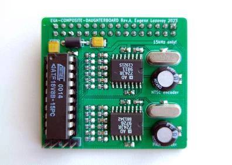

## EGA composite daughterboard
Daughterboard for EGA feature connector, providing CVBS composite video encoder. With this board you can connect your EGA videocard to TV using two RCA jacks, which is usually unused on most EGA cards. One jack is feed by NTSC encoder, other by PAL.

For proper work you must set card to CGA-compatible mode. If card tries to output EGA-Hi-Res modes, composite output will be unsupported by most monitors.

Please note that CGA composite colors will not display properly.

### Jumper setting
* JP1 is not installed - RGBI color mode
* JP1 installed        - RrGgBb color mode (just for testing)
* JP2 is not installed - separate sync for AD724
* JP2 installed        - composite sync for AD724 (just for testing)

Normally both jumper shouldn't be installed.

### Changelog
* Rev.A - initial release
* Rev.A1 - add option to use ISA clock for NTSC encoder; improve power circuit

### Related projects
- https://github.com/monotech/EGA-Mono-Composite-Coverter
- https://github.com/hkzlab/ISA_EGA_CHIPS
